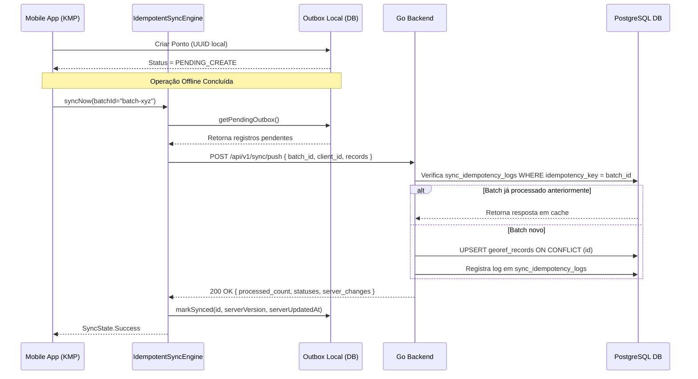

# Monorepo GeoRef: Architecture & Offline-First Idempotent Sync Protocol

## 1. Visão Geral da Arquitetura (Monorepo)

O projeto **GeoRef** foi construído com arquitetura **Offline-First**, focado em dispositivos móveis (Android e iOS) que atuam em campo em locais sem conectividade com a internet por longos períodos.

```
georef/
├── backend/                      # Backend em GoLang + PostgreSQL (PostGIS)
│   ├── cmd / main.go             # Servidor REST HTTP
│   ├── db/migrations             # Migrações SQL do Postgres
│   └── internal/
│       ├── api/                  # Endpoints REST (/health, /api/v1/sync/*)
│       ├── db/                   # Connection Pool pgx v5
│       ├── models/               # DTOs e entidades
│       ├── repository/           # Consultas SQL e cláusulas de idempotência (ON CONFLICT)
│       └── sync/                 # Mecanismo de resolução de conflitos no servidor
├── mobile/                       # Monorepo Kotlin Multiplatform (KMP)
│   ├── shared/                   # Código compartilhado entre Android e iOS
│   │   └── src/commonMain/       # IdempotentSyncEngine, LocalDatabase, Outbox, Ktor Client
│   ├── androidApp/               # Interface Android Nativa em Jetpack Compose
│   └── iosApp/                   # Interface iOS Nativa em SwiftUI
├── docker-compose.yml            # Orquestração local do PostgreSQL + Go Backend
└── docs/                         # Documentação Técnica da Arquitetura
```

---

## 2. Padrão Offline-First & Armazenamento Assíncrono Local

### Desafios de Operação em Campo:
- Dispositivos vão para o campo sem conexão com a internet por horas ou dias.
- Várias medições e pontos georreferenciados são criados/editados/deletados localmente.
- Quando a internet retorna, a sincronização deve ser executada de forma **assíncrona e idempotente**, sem duplicar dados nem perder atualizações.

### Padrão de Fila de Saída (Outbox Queue Pattern):
1. **Identificadores Globais no Cliente**: Cada objeto recebe um `UUID v4` gerado no dispositivo no momento da criação.
2. **Estados Globais de Sincronização**:
   - `PENDING_CREATE`: Criado offline, ainda não enviado ao servidor.
   - `PENDING_UPDATE`: Editado offline, alteração pendente de envio.
   - `PENDING_DELETE`: Removido offline (soft delete), pendente de exclusão remota.
   - `SYNCED`: Estado sincronizado com confirmação do servidor.
3. **Controle de Concorrência Local em Kotlin**:
   - Uso de `Mutex` e `StateFlow` no KMP para garantir leituras/escritas thread-safe e reativas na UI móvel.

---

## 3. Mecanismo de Sincronização Idempotente

### Por que Idempotência?
Re-envios de requisições de rede devido a oscilação do sinal de celular podem fazer com que o servidor receba o mesmo lote de dados 2 ou mais vezes. O protocolo de idempotência garante que **chamar a API N vezes produz o mesmo efeito exato de chamá-la 1 vez**.

### Fluxo de Execução do `IdempotentSyncEngine`:



---

## 4. Estratégia de Resolução de Conflitos (Last-Write-Wins + Versioning)

Para tratar alterações no mesmo registro efetuadas em dispositivos diferentes ou no servidor:

- Cada registro mantém um número de **versão (`version`)** incremental e um timestamp `client_updated_at`.
- No PostgreSQL (`repository/georef_repository.go`):
  ```sql
  -- Caso o registro cliente seja mais recente ou de versão maior:
  -- Atualiza o registro e incrementa server_version.
  -- Caso o registro cliente seja antigo/obsoleto:
  -- Rejeita a alteração cliente com status "IGNORED_STALE" e retorna a versão atual do servidor.
  ```

---

## 5. Como Executar o Monorepo

### Pré-requisitos:
- Docker e Docker Compose
- Go (1.20+)
- JDK 17+

### 1. Iniciar Banco PostgreSQL e Backend em Go:
```bash
docker-compose up -d --build
```
*O servidor HTTP iniciará na porta `:8080`.*

### 2. Testar Saúde da API Go:
```bash
curl http://localhost:8080/health
```

### 3. Compilar o Backend Go nativamente (sem Docker):
```bash
cd backend
go run main.go
```

### 4. Estrutura do App Móvel Kotlin Multiplatform:
- Abrir a pasta `mobile/` no Android Studio ou IntelliJ IDEA.
- Executar a aplicação Android (`:androidApp`) ou iOS (`:iosApp`).
